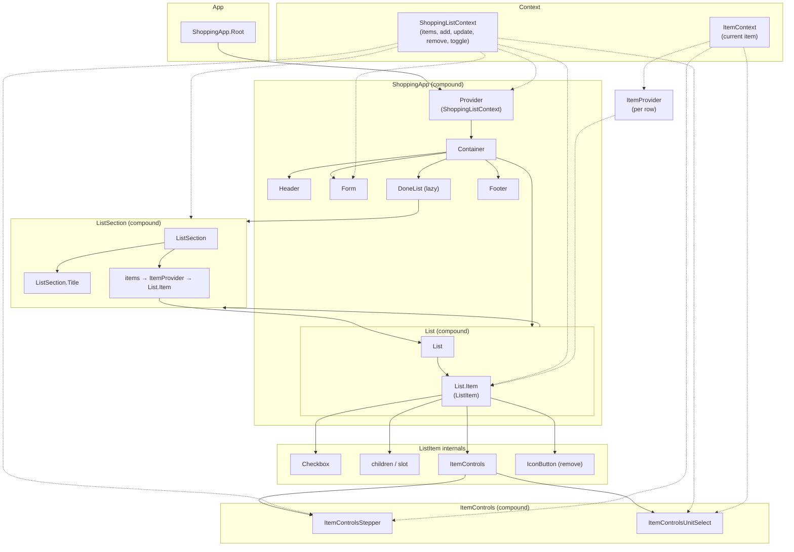

# React Composition

A **simple example** to show React composition in practice. It’s a minimal shopping list UI so the focus stays on patterns—**compound components**, **context**, **slots**, and **custom hooks**—rather than app features.

## Tech stack

- **React 19** + TypeScript
- **Vite 7** (dev, build, lazy loading)
- **Tailwind CSS 4**

## Scripts

| Command   | Description        |
| --------- | ------------------ |
| `npm run dev`    | Start dev server   |
| `npm run build`  | Type-check + build |
| `npm run preview`| Preview production build |
| `npm run lint`   | Run ESLint         |

## Composition overview

The UI is built from **compound components** that share state via **context** and **hooks**:

- **ShoppingApp** — Root layout with Provider, Container, and slots (Header, Form, List, DoneList, Footer). List sections are lazy-loaded.
- **List** — `List` + `List.Item`; each row is wrapped in **ItemProvider** so item-specific controls read from **ItemContext**.
- **ListSection** — Section container with optional `ListSection.Title`; renders a list of items, each in an **ItemProvider**.
- **ItemControls** — Per-row controls composed of **ItemControlsStepper** (quantity) and **ItemControlsUnitSelect** (unit); both use **ItemContext** and **ShoppingListContext**.

Global list state lives in **ShoppingListContext** (add, update, remove, toggle). Per-item state is provided by **ItemContext** (current item) so `ListItem` and `ItemControls` stay decoupled from parent data.

Below is a diagram of the component and context flow.

## Architecture



## Project structure

```
src/
├── components/       # UI components and compound pieces
├── context/          # React context definitions
├── hooks/            # useShoppingList, useItemContext, etc.
├── providers/        # ShoppingListProvider, ItemProvider
├── types.ts
└── utils/
```
